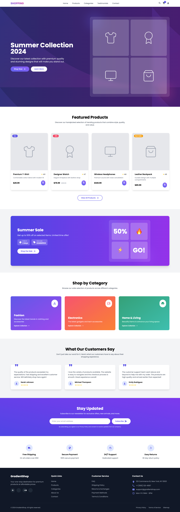

# 🌟 Tailwind Templates Collection

A curated collection of modern, responsive website templates built with **Tailwind CSS**. Each template is designed for real-world use cases — from business landing pages to personal portfolios — and optimized for pixel-perfect responsiveness and clean design.

---

## 📁 Templates

| Template Name                 | Preview                             | Live Demo                        |
|------------------------------|-------------------------------------|----------------------------------|
| E-commerce Homepage          |  | [Live](https://tailwind-templates-red.vercel.app/ecommerce/) |
| MedSPA Landing Page          |      | [Live](https://tailwind-templates-red.vercel.app/MedSpa/) |
| KidsPlay Online Booking Site |    | [Live](https://tailwind-templates-red.vercel.app/KidsPlay/) |
| Bowling Activities Landing   |     | [Live](https://bowling.vercel.app) |
| Online Education Site        |      | [Live](https://tailwind-templates-red.vercel.app/education/) |
| Real Estate Listings UI      |      | [Live](https://realestate.vercel.app) |
| App Promo Landing Page       |           | [Live](https://apppromo.vercel.app) |
| UI/UX Agency Portfolio       |    | [Live](https://agency.vercel.app) |
| Personal Portfolio Site      |  | [Live](https://portfolio.vercel.app) |

---

## 🛠️ Tech Stack

- HTML5 + Tailwind CSS
- Fully responsive layouts
- Accessible, scalable UI structure
- Designed for quick deployment (Vercel-ready)

---

## 🚀 Deployment

All templates are ready for deployment to **[Vercel](https://vercel.com/)**. Each project folder can be deployed as a standalone site.

---

## 📌 How to Use

1. Clone the repo:  
   ```bash
   git clone https://github.com/uttamrapeti/tailwind-templates.git
